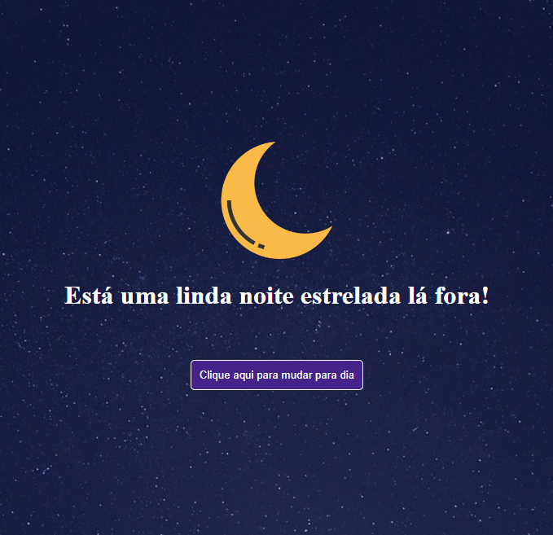

<h1 style="text-align: center;">Projeto Dia e Noite</h1>

Este é o projeto que eu consegui desenvolver sozinho após 5 dias estudando programação do absoluto zero.
Usando funções e noções básicas (básicas mesmo) de HTML, CSS e JavaScript, eu fiz um site capaz de mudar seu estilo dinamicamente através do poder do JavaScript para o modo diurno e noturno.

Este projeto foi feito principalmente para eu testar e praticar todos os conceitos de programação que eu aprendi nesses 5 primeiros dias de estudo e evidenciar para mim mesmo o meu progresso, partindo de um ponto em que eu não tinha nenhuma noção programação para um domínio das noções mais básicas da tríade de linguagens de programação mais utilizada no desenvolvimento web.

<b>Segue abaixo uma demonstração do modo diurno e noturno do meu projeto.</b>

Sei que é um projeto extremamente simples e básico, mas eu comecei a estudar do absoluto zero há apenas 5 dias e ainda estou começando. Espero conseguir fazer projetos mais interessantes e complexos em um futuro próximo! 😊

<b>Tecnologias utilizadas:</b>

<ul style="margin: 10px; text-align: center; align-items: center; justify-content: center; display: flex;">
<li style="margin: 30px">HTML</li>
<li style="margin: 30px">CSS</li>
<li style="margin: 30px">JavaScript</li>
</ul>